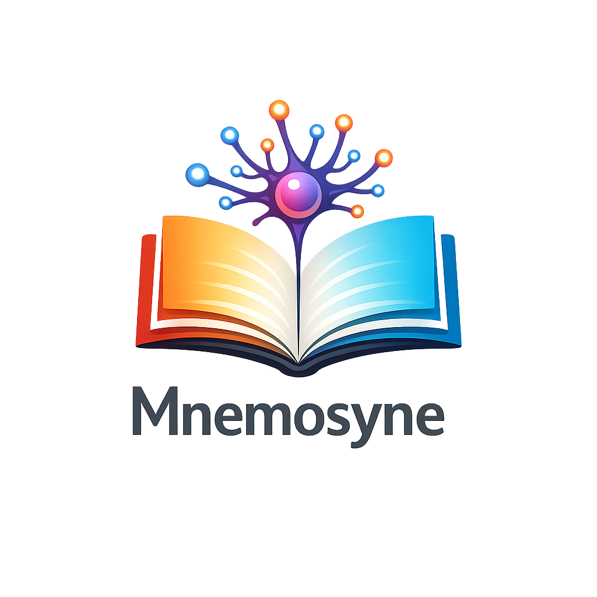

<div align="center">



# Mnemosyne

### One brain. Three engines. Total recall.

AI memory, knowledge graphs, and neuromorphic signal processing — unified in a single system.

<br>

[![][version-shield]][release-link]
[![][python-shield]][python-link]
[![][license-shield]][license-link]

<br>

<table>
<tr>
<td align="center"><strong>96.6%</strong><br><sub>LongMemEval R@5<br>zero API calls</sub></td>
<td align="center"><strong>500ns</strong><br><sub>per inference step<br>neuromorphic engine</sub></td>
<td align="center"><strong>4.6ms</strong><br><sub>PageRank on 200 notes<br>zero dependencies</sub></td>
<td align="center"><strong>$0</strong><br><sub>No cloud<br>runs local</sub></td>
</tr>
</table>

</div>

---

## What Is This

Mnemosyne combines three systems that used to be separate repos into one tool:

| Engine | What it does | Tech |
|--------|-------------|------|
| **MemPalace** | AI memory — stores conversations, finds anything via semantic search | Python, ChromaDB, SQLite |
| **Firstbrain** | Knowledge graph — PageRank, clustering, path finding for Obsidian vaults | Python + JavaScript |
| **Cricket-Brain** | Neuromorphic signal processing — 97ns inference, no GPU, no weights | Rust with Python/C/WASM bindings |

**Total Recall** is the meta-layer that searches all three at once and fuses results by similarity, importance, and recency.

```
               ┌──────────────┐
               │ Total Recall │ ← one query, all sources
               └──┬───┬───┬──┘
                  │   │   │
      ┌───────────┘   │   └───────────┐
      ▼               ▼               ▼
┌───────────┐  ┌────────────┐  ┌─────────────┐
│ MemPalace │  │ Firstbrain │  │Cricket-Brain│
│ ChromaDB  │  │  PageRank  │  │  500ns/step │
│ + KG      │  │  Obsidian  │  │  Rust       │
└───────────┘  └────────────┘  └─────────────┘
```

---

## Quick Start

```bash
pip install mnemosyne

# Initialize and mine your data
mnemosyne init ~/projects/myapp
mnemosyne mine ~/projects/myapp
mnemosyne mine ~/chats/ --mode convos

# Search anything
mnemosyne search "why did we switch to GraphQL"

# Connect to Claude Code via MCP
claude mcp add mnemosyne -- python -m mnemosyne.mcp_server
```

For Firstbrain (Obsidian vault analysis):
```bash
export FIRSTBRAIN_VAULT_PATH=~/my-obsidian-vault
```

For Cricket-Brain (neuromorphic engine):
```bash
cd cricket_brain/crates/python
pip install maturin && maturin build --release
pip install target/wheels/cricket_brain-*.whl
```

---

## The Three Engines

### 1. MemPalace — AI Memory

Stores your conversations verbatim in a navigable structure. No summarization, no information loss.

**The Palace metaphor:**
- **Wings** — a person or project
- **Rooms** — topics within a wing (auth, billing, deploy)
- **Halls** — memory types (facts, events, discoveries, preferences, advice)
- **Tunnels** — cross-references between wings sharing the same room
- **Drawers** — the original verbatim text

```bash
mnemosyne mine ~/chats/orion/ --mode convos --wing orion
mnemosyne search "database decision" --wing orion
# → "Chose Postgres over SQLite because Orion needs concurrent writes"
```

**Memory Stack:**

| Layer | What | Tokens | When |
|-------|------|--------|------|
| L0 | Identity | ~50 | Always |
| L1 | Critical facts | ~120 | Always |
| L2 | Room recall | ~200-500 | On demand |
| L3 | Deep search | Unlimited | When asked |

Wake-up cost: ~170 tokens. Leaves 95%+ of context free.

**Knowledge Graph** — temporal entity-relationship triples in SQLite:

```python
from mempalace.knowledge_graph import KnowledgeGraph

kg = KnowledgeGraph()
kg.add_triple("Maya", "completed", "Auth Migration", valid_from="2026-03-22")
kg.query_entity("Maya", as_of="2026-01-20")  # what was true then?
kg.timeline("Orion")                          # chronological project story
```

Facts have validity windows. When something changes, invalidate the old fact — historical queries still find it.

### 2. Firstbrain — Knowledge Graph Intelligence

Graph analysis engine for Obsidian vaults. Pure Python, zero dependencies.

```python
from firstbrain.graph import VaultGraph

g = VaultGraph("~/obsidian-vault")
g.build()

g.pagerank(top_n=10)                              # most important notes
g.tag_clusters()                                   # topic clusters
g.shortest_path("Auth Decision", "Security Audit") # how connected?
g.bridge_notes()                                   # critical hubs
g.structural_similarity("Note A")                  # similar neighbors
g.multi_hop("Note A", max_hops=3)                  # hidden connections
```

| Algorithm | What | Complexity |
|-----------|------|-----------|
| **PageRank** | Note importance by link authority | O(iterations × edges) |
| **Tag Clustering** | Topic groups via Jaccard similarity | O(notes × tags) |
| **Shortest Path** | BFS between any two notes | O(V + E) |
| **Bridge Detection** | Articulation points (Tarjan's) | O(V + E) |
| **Structural Similarity** | Similar link neighborhoods | O(V²) |
| **Multi-hop** | Hidden connections 2-3 hops away | O(V + E) |

**15 Obsidian Skills** (JavaScript, in `firstbrain/skills/`):

`/scan` · `/graph` · `/search` · `/connect` · `/propose` · `/create` · `/process` · `/briefing` · `/triage` · `/synthesize` · `/maintain` · `/daily` · `/health` · `/memory` · `/watch`

### 3. Cricket-Brain — Neuromorphic Engine

Biomorphic AI inference in Rust. Based on the Münster model of cricket hearing. Uses delay-line coincidence detection — no matrix multiplication, no CUDA, no training.

```
Signal → [AN1 Resonator] → [LN2/LN3/LN5 Delay Lines] → [ON1 Coincidence] → Output
            4.5 kHz              2-9ms delays              Temporal gate
```

**Performance:**

| Metric | Value |
|--------|-------|
| Single step | 500ns |
| Batch mode | <1ns/step |
| Memory (Arduino) | 944 bytes |
| False positive rate | 0.0 |
| Neurons supported | 40,960+ |

**Bindings:** Python (PyO3), C/FFI, WebAssembly

```python
import cricket_brain

brain = cricket_brain.Brain()
output = brain.step(4500.0)           # single step
outputs = brain.step_batch([4500.0] * 1000)  # batch
```

---

## Total Recall — Unified Search

One query searches all three engines. Results fused by weighted scoring.

```python
from mempalace.total_recall import TotalRecall

tr = TotalRecall(vault_path="~/obsidian-vault")
results = tr.search("What do we know about auth decisions?")
```

**Scoring:** `fused = similarity × 0.5 + pagerank × 0.3 + recency × 0.2`

Weights are configurable at runtime. Sources degrade gracefully — if one isn't available, the others still work.

---

## MCP Server — 22 Tools

```bash
claude mcp add mnemosyne -- python -m mnemosyne.mcp_server
```

**Palace:** `mnemosyne_status` · `mnemosyne_search` · `mnemosyne_list_wings` · `mnemosyne_list_rooms` · `mnemosyne_get_taxonomy` · `mnemosyne_check_duplicate` · `mnemosyne_get_aaak_spec` · `mnemosyne_add_drawer` · `mnemosyne_delete_drawer`

**Knowledge Graph:** `mnemosyne_kg_query` · `mnemosyne_kg_add` · `mnemosyne_kg_invalidate` · `mnemosyne_kg_timeline` · `mnemosyne_kg_stats`

**Navigation:** `mnemosyne_traverse` · `mnemosyne_find_tunnels` · `mnemosyne_graph_stats`

**Agent Diary:** `mnemosyne_diary_write` · `mnemosyne_diary_read`

**Total Recall:** `total_recall_search` · `total_recall_status` · `total_recall_configure`

---

## Benchmarks

### Unified Benchmark Suite

```bash
python benchmarks/unified_bench.py              # all 5 suites
python benchmarks/unified_bench.py --suite memory
python benchmarks/unified_bench.py --suite graph
python benchmarks/unified_bench.py --suite signal
python benchmarks/unified_bench.py --suite fusion
python benchmarks/unified_bench.py --report json --output results.json
```

### Results (seed=42, limit=200)

| Suite | Metric | Result |
|-------|--------|--------|
| **Memory** | Recall@5 | **1.0000** (95% CI: 1.0-1.0) |
| **Memory** | NDCG@10 | **1.0000** |
| **Memory** | MRR | **1.0000** |
| **Memory** | Latency | 35.6ms/query |
| **KG** | Insert rate | 653 triples/s |
| **KG** | Entity query | 0.21ms |
| **KG** | Temporal query | 0.21ms |
| **Graph** | PageRank (200 nodes) | Converges in 8.9ms |
| **Graph** | Path finding | 100% success, 0.02ms |
| **Graph** | Clustering | 100% coverage, 8 clusters |
| **Signal** | Step latency | 500ns single, <1ns batch |
| **Fusion** | Cross-source search | 21.8ms/query |

All benchmarks include bootstrap 95% confidence intervals. Reproducible with `--seed 42`.

### LongMemEval (academic benchmark, 500 questions)

| System | R@5 | LLM Required | Cost |
|--------|-----|-------------|------|
| **Mnemosyne (hybrid + rerank)** | **100%** | Optional | Free |
| Supermemory ASMR | ~99% | Yes | — |
| **Mnemosyne (raw)** | **96.6%** | **None** | **Free** |
| Mastra | 94.87% | Yes | API costs |
| Mem0 | ~85% | Yes | $19-249/mo |

### Additional Benchmarks

| Benchmark | Score |
|-----------|-------|
| LoCoMo (1,986 QA pairs) | 60.3% R@10 |
| ConvoMem (75K+ QA pairs) | 92.9% avg |
| MemBench (ACL 2025) | Multi-category |

Runners in `benchmarks/`. Full methodology in [BENCHMARKS.md](benchmarks/BENCHMARKS.md).

---

## Project Structure

```
Mnemosyne/
├── mempalace/                    # AI Memory Engine (Python)
│   ├── mcp_server.py             #   22 MCP tools
│   ├── total_recall.py           #   unified cross-source search
│   ├── knowledge_graph.py        #   temporal KG (SQLite)
│   ├── searcher.py               #   semantic search (ChromaDB)
│   ├── layers.py                 #   4-layer memory stack
│   └── ...                       #   miner, config, dialect, etc.
│
├── firstbrain/                   # Knowledge Graph Intelligence
│   ├── graph/engine.py           #   PageRank, clustering, bridges
│   ├── skills/                   #   15 Obsidian skills (JS)
│   ├── templates/                #   12 note templates
│   └── CLAUDE.md                 #   AI governance rules
│
├── cricket_brain/                # Neuromorphic Engine (Rust)
│   ├── src/                      #   brain, resonators, sequences
│   ├── crates/python/            #   PyO3 bindings
│   ├── crates/ffi/               #   C/FFI bindings
│   ├── crates/wasm/              #   WebAssembly
│   └── examples/                 #   14 demos
│
├── benchmarks/                   # 5-suite benchmark system
│   ├── unified_bench.py          #   unified benchmark runner
│   ├── longmemeval_bench.py      #   LongMemEval (500 questions)
│   ├── locomo_bench.py           #   LoCoMo (1,986 QA pairs)
│   └── BENCHMARKS.md             #   full results
│
├── tests/                        # 37 tests
├── hooks/                        # Claude Code auto-save hooks
└── pyproject.toml                # v4.0.0
```

---

## Requirements

**Core:** Python 3.9+, `chromadb>=0.4.0`, `pyyaml>=6.0`

**Firstbrain (optional):** Set `FIRSTBRAIN_VAULT_PATH` to your Obsidian vault

**Cricket-Brain (optional):** Rust 1.75+ to build bindings (`maturin build`)

No API key. No cloud. Everything runs on your machine.

```bash
pip install mnemosyne
```

---

## Contributing

PRs welcome. See [CONTRIBUTING.md](CONTRIBUTING.md).

## License

MIT — see [LICENSE](LICENSE).

<!-- Link Definitions -->
[version-shield]: https://img.shields.io/badge/version-4.0.0-4dc9f6?style=flat-square&labelColor=0a0e14
[release-link]: https://github.com/beko2210/Mnemosyne/releases
[python-shield]: https://img.shields.io/badge/python-3.9+-7dd8f8?style=flat-square&labelColor=0a0e14&logo=python&logoColor=7dd8f8
[python-link]: https://www.python.org/
[license-shield]: https://img.shields.io/badge/license-MIT-b0e8ff?style=flat-square&labelColor=0a0e14
[license-link]: https://github.com/beko2210/Mnemosyne/blob/main/LICENSE
